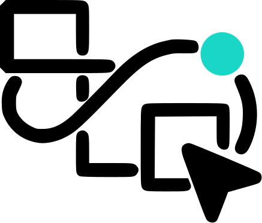

<p align="center">
  
  <span style="font-size: 2em; font-weight: bold; margin-left: 10px;">Melina Studio</span>
</p>

<p align="center">
  <strong>Cursor for Canvas</strong><br/>
  Describe your intent. Melina handles the canvas.
</p>

<p align="center">
  <a href="#features">Features</a> •
  <a href="#tech-stack">Tech Stack</a> •
  <a href="#getting-started">Getting Started</a> •
  <a href="#project-structure">Project Structure</a> •
  <a href="#contributing">Contributing</a>
</p>

---

## About

Melina Studio is an AI-powered design platform that lets you create stunning visuals through natural language. Simply describe what you want to create, and Melina translates your intent into beautiful designs on the canvas.

## Features

- **AI-Powered Design** - Describe your design intent in natural language
- **Interactive Canvas** - Built with Konva for smooth, performant canvas interactions
- **Real-time Collaboration** - Work seamlessly with your team
- **Theme Support** - Beautiful light and dark modes with smooth transitions
- **3D Elements** - Integrated Three.js for 3D model viewing and manipulation
- **Modern UI** - Clean, responsive interface built with Tailwind CSS

## Tech Stack

- **Framework**: [Next.js 16](https://nextjs.org/) with App Router
- **Language**: [TypeScript](https://www.typescriptlang.org/)
- **Styling**: [Tailwind CSS 4](https://tailwindcss.com/)
- **Canvas**: [Konva](https://konvajs.org/) / [React Konva](https://konvajs.org/docs/react/)
- **3D Graphics**: [Three.js](https://threejs.org/) / [React Three Fiber](https://docs.pmnd.rs/react-three-fiber)
- **Animation**: [GSAP](https://gsap.com/) / [Framer Motion](https://www.framer.com/motion/)
- **State Management**: [Zustand](https://zustand-demo.pmnd.rs/)
- **AI Integration**: [Vercel AI SDK](https://sdk.vercel.ai/)
- **UI Components**: [Radix UI](https://www.radix-ui.com/)

## Getting Started

### Prerequisites

- Node.js 18.17 or later
- npm, yarn, pnpm, or bun

### Installation

1. Clone the repository:

```bash
git clone https://github.com/melina-studio/melina-studiov2.git
cd melina-studio/Frontend/melina-studiov2
```

2. Install dependencies:

```bash
npm install
# or
yarn install
# or
pnpm install
# or
bun install
```

3. Run the development server:

```bash
npm run dev
# or
yarn dev
# or
pnpm dev
# or
bun dev
```

4. Open [http://localhost:3000](http://localhost:3000) in your browser.

## Project Structure

```
src/
├── app/                    # Next.js App Router pages
│   ├── (landing)/          # Landing page routes
│   ├── auth/               # Authentication pages
│   └── playground/         # Canvas playground
├── blocks/                 # Reusable block components
│   ├── Animations/         # Animation components (Noise, etc.)
│   └── Backgrounds/        # Background effects (LightRays, etc.)
├── components/
│   ├── landing/            # Landing page components
│   └── ui/                 # UI components (buttons, inputs, etc.)
├── lib/                    # Utility functions
└── stores/                 # Zustand state stores
```

## Scripts

| Command         | Description              |
| --------------- | ------------------------ |
| `npm run dev`   | Start development server |
| `npm run build` | Build for production     |
| `npm run start` | Start production server  |
| `npm run lint`  | Run ESLint               |

## Contributing

Contributions are welcome! Please feel free to submit a Pull Request.

1. Fork the repository
2. Create your feature branch (`git checkout -b feature/amazing-feature`)
3. Commit your changes (`git commit -m 'Add some amazing feature'`)
4. Push to the branch (`git push origin feature/amazing-feature`)
5. Open a Pull Request

## License

This project is licensed under the MIT License.

---

<p align="center">
  Built with care by the Melina Studio team
</p>
